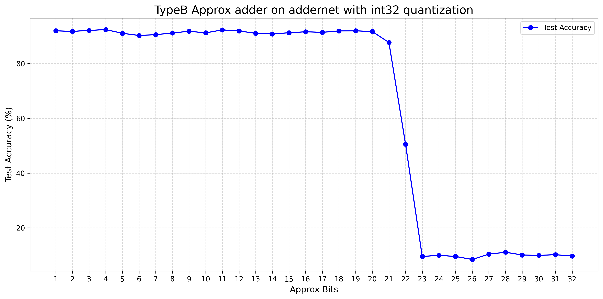
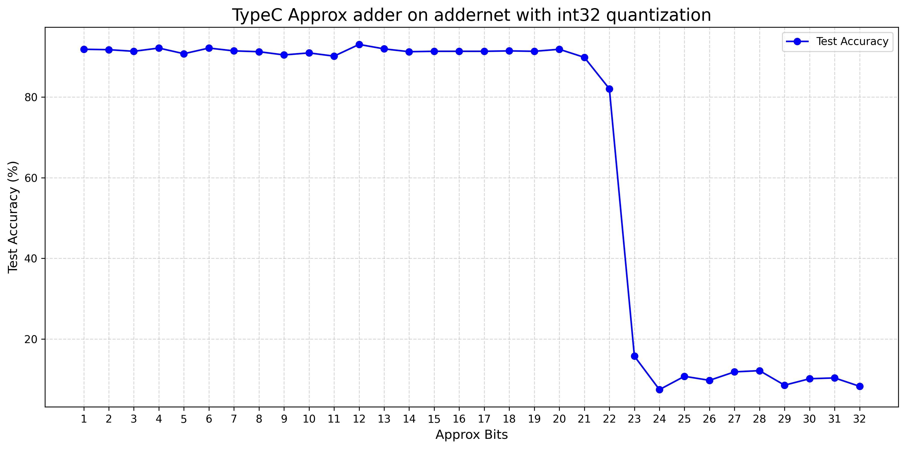

## ADDERNET APPROX 
### 结构
模型定义放置于 resnet20.py resnet50.py 与 resnet20MNIST.py 中 区别在于模型规模与输入，renet20与resnet50为3通道输入（彩色），resnet20MNIST为1通道输入（灰度）
模型训练代码放置于 cifar_train.py 与mnist_train.py 中这两个训练程序依赖于pytorch与原文保持一致
自定义算子放置在 adder_approx.py 中 其中 xxx_32指的是全部拟合的部分，其余的为可调位数，由于全部拟合的情况需要单独处理进位与溢出的计算。
综合测试代码放置于numpy_addernet_dynamic_q32_approx_clean中，这个代码没有torch依赖，仅需要numpy 与 numba(加速器)即可运行，CIFAR10.py是无torch的CIFAR10数据集读取代码。
#### 训练
训练程序请看cifar_train.py 与mnist_train.py,

此处与原文的训练代码保持一致，在CIFAR10数据集上训练Resnet10模型，其中的卷积层被替换成adder卷积层。adder 卷积层中的卷积核被替换成adder核，同时互相关计算方法被替换成卷积核与被卷积区域的矩阵减法。由于torch难以进行自定义算子的实现，所以将torch训练得出的权重转换到numpy下进行推理。转换后的state_dict被保存至addernet_CIFAR10_best.pickle

#### 测试
主要工作在于，首先编写了一套不依赖于torch的推理代码，将addernet模型转换成numpy，然后进行推理。其次是实现了自定义的卷积层，在其中实现int32动态对称量化并使用实现的近似计算进行推理。

核心修改在于
~~~ python
def forward_adder2d_approx(X, W, stride=1, padding=0, bias=None):
    ...
output = -np.abs(
        approx_sum_C(W_q[:, :, np.newaxis], -cols_q[np.newaxis, :, :], approx_bits)
    )
    ...
~~~

替换此处的approx_sum_C 即可切换拟合模式，测试程序采取有符号int32动态对称量化，即在运行中获取两个操作数或者矩阵后，对其大小进行检测，以两个数或矩阵中最大的数位作为量化scale，然后进行量化，将所有此处的被操作数缩放到int32范围内。随后进行近似计算，计算结束后进行反量化回到浮点数传递给下一层。
随后在CIFAR的测试集上进行测试并记录其准确度，保存每个位的准确度到

TypeB_adder-resnet20_CIFAR10_q32.txt

TypeC_adder-resnet20_CIFAR10_q32.txt

两个文件中，并用plot_test.py进行可视化

最终结果为：

